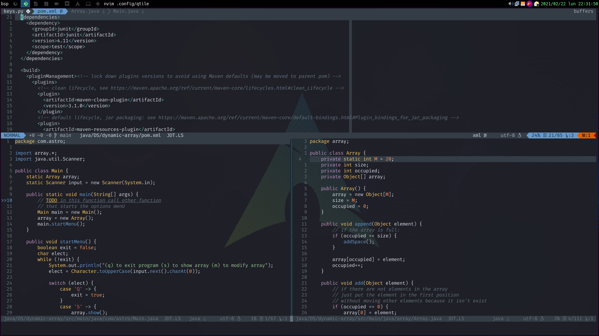

## Configuration for _NeoVim_ made by Juan Alejandro Marín Ruiz

---
### Dependencies

- It needs the **python interfaces** to use that its necessary [pip](https://pypi.org/project/pip/) ``pip install neovim``.
- It needs too [nodejs](https://github.com/nvm-sh/nvm) **12 or higher**.
- For some plugins its necessary [yarn](https://yarnpkg.com/) like prettier.
- It use the plugin manager [vim-plug](https://github.com/junegunn/vim-plug)
---
